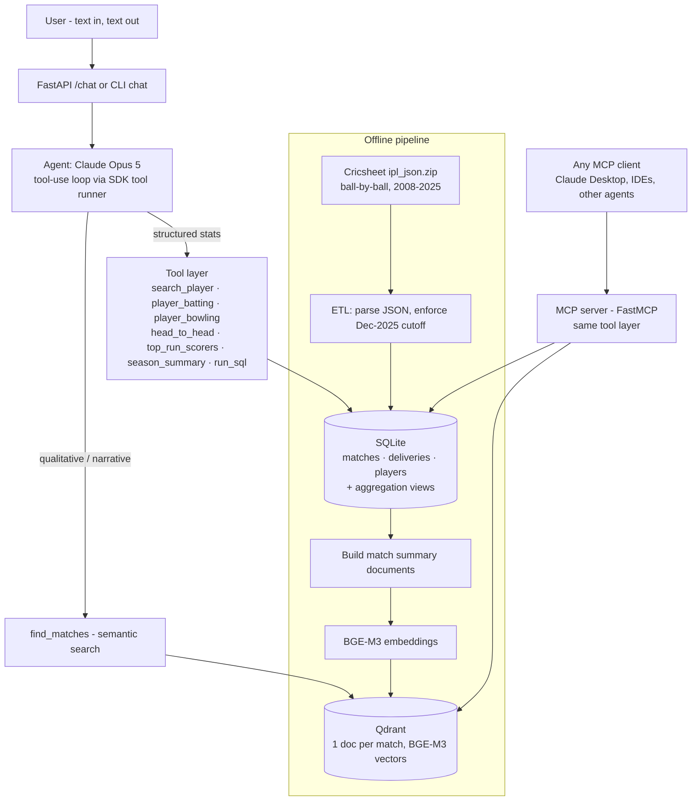
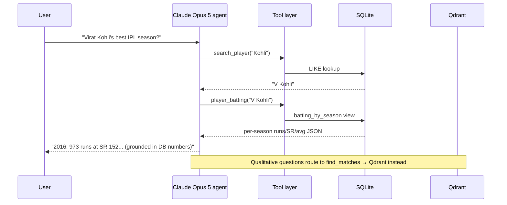

# IPL AI Assistant — Text-to-Text Cricket Agent (2008 → 31 Dec 2025)

A production-style, text-to-text AI assistant for the Indian Premier League covering every
season from the first (2008) through **31 December 2025**. It combines a relational stats
store, a vector database with dense embeddings (RAG), an LLM agent with tool calling, an
**MCP server** so any MCP client can reuse the same tools, and a Docker Compose deployment.

The whole implementation is **one Python file** ([app.py](app.py)) with clearly separated
sections — ETL, RAG indexing, tool layer, agent, MCP server, HTTP API — the way a
3-year-experience engineer would structure a focused MVP before splitting it into modules.

---

## 1. What it answers

| Question type | Mechanism |
|---|---|
| "Virat Kohli's career IPL runs and strike rate" | SQL aggregation views → `player_batting` tool |
| "Who won the Purple Cap in 2021?" | `top_wicket_takers(season=2021)` |
| "Head-to-head MI vs CSK" | `head_to_head` |
| "Who won IPL 2025 and by how much?" | `season_summary(2025)` |
| "Show me super-over thrillers at Wankhede" | **RAG**: BGE-M3 embeddings + Qdrant semantic search |
| "Best economy in 2023 among bowlers with 40+ overs" | agent writes read-only SQL via `run_sql` |
| Anything non-IPL or post-2025 | politely refused (system-prompt guardrail) |

---

## 2. Architecture



### Query flow (sequence)



**Key design decision — hybrid retrieval, not "RAG for everything":**
LLMs hallucinate numbers; embeddings are lossy for exact aggregation. So **every numeric
answer comes from SQL** (deterministic, exact), and the **vector DB only serves qualitative
recall** ("find matches like X"). This split is the single biggest accuracy lever in a
sports-stats assistant.

---

## 3. Tech choices and why

### 3.1 Data source — Cricsheet

| Option | Verdict |
|---|---|
| **Cricsheet `ipl_json.zip`** ✅ | Free, structured ball-by-ball JSON for every IPL match 2008→2025. One file per match, no scraping, no auth. |
| ESPNcricinfo / Cricbuzz scraping | Fragile, ToS-risky, unnecessary for historical data |
| Paid APIs (Sportradar, CricAPI) | Only needed for **live** data — out of scope (our cutoff is Dec 2025, and IPL 2025 ended 3 June 2025) |

Reality check: Cricsheet has **no player bios, no official award records**. Orange/Purple Cap
are *computed* from ball-by-ball data (most runs / most wickets), which matches the official
result in practice. This limitation is documented to the model in `season_summary`'s output.

### 3.2 Structured store — SQLite

PostgreSQL is the "grown-up" answer, but for **~1,170 matches / ~278K deliveries** (read-only
after ETL) SQLite is strictly better for v1: zero infra, single file, ships inside the Docker
image volume, and aggregation over 278K rows is milliseconds. The tool layer is plain SQL, so
swapping to Postgres later is a connection-string change, not a redesign. Season labels from
Cricsheet ("2007/08") are normalized to integer years during ETL so `season = 2008` always works.

### 3.3 Vector database — Qdrant

2026 comparisons consistently rank **Qdrant** as the best production default for RAG: written
in Rust, fastest on filtered queries, lightest to operate, first-class Docker image, and the
Python client has an **embedded local mode** (no server needed for dev) with the same API as
the server mode — perfect for a project that must run both on a laptop and in Compose.

| Candidate | Why not |
|---|---|
| Chroma | Great for prototypes; weaker production/ops story |
| Milvus | Built for billions of vectors; heavy ops overhead for ~1.2K docs |
| pgvector | Best *if already on Postgres* — we deliberately aren't (yet) |
| Pinecone/Weaviate Cloud | Managed cost + vendor lock-in unjustified at this scale |

### 3.4 Embeddings — BAAI/bge-m3

2026 consensus: **BGE-M3** is the default open-source retrieval workhorse — MIT license,
100+ languages, 8K context, unified dense/sparse/multi-vector retrieval, and pairs with
`bge-reranker-v2` if you later add a rerank stage. Qwen3-Embedding-8B scores higher on MTEB
but needs ~5 GB+ memory; for ~1,200 short documents the quality delta is irrelevant and
BGE-M3 (568M params, runs on CPU) is the pragmatic best.

Configurable via `EMBED_MODEL` env: use `BAAI/bge-small-en-v1.5` (384-dim, ~130 MB) on
low-RAM machines, or an API embedding model if you don't want local inference at all.

### 3.5 LLM — switchable: Gemini (free tier) or Claude Opus 5

The agent supports two providers, auto-detected from which API key is set
(`GEMINI_API_KEY` → Gemini, `ANTHROPIC_API_KEY` → Claude; override with `LLM_PROVIDER`).

**Zero-budget path: Gemini 2.5 Flash.** Google AI Studio (aistudio.google.com) issues free
API keys with no credit card; the free tier is rate-limited (roughly 10 requests/min and a
few hundred/day) but plenty for development and demos. The `google-genai` SDK's automatic
function calling runs the tool loop directly from the shared tool functions' type hints and
docstrings — no extra schema code.

**Paid path: Claude Opus 5** — stronger multi-hop tool use, the choice when accuracy on
complex analytical questions matters most:

| Requirement | Why Opus 5 fits |
|---|---|
| Multi-step tool use (resolve name → fetch stats → compose) | Current best-in-class agentic tool calling; adaptive thinking on by default |
| No hallucinated stats | Strong instruction following: "never state a number without a tool call" is actually honored |
| Cost | $5 / $25 per MTok; each answer is a few small tool calls — cents per query |
| SDK ergonomics | `client.beta.messages.tool_runner` runs the whole agentic loop; `@beta_tool` generates JSON schemas from type hints — no LangChain needed |

Alternatives, honestly ranked for this workload:

| Model | Trade-off |
|---|---|
| `claude-sonnet-5` | ~40% cheaper, near-Opus on tool use — the right choice if query volume grows |
| `claude-haiku-4-5` | Cheapest; fine for simple lookups, weaker on multi-hop questions |
| Local (Ollama: Llama 3.3 70B / Qwen 2.5 72B via vLLM) | Fully offline + free inference, but you own GPU infra and tool-calling reliability drops noticeably |

The code also enables Anthropic's **server-side refusal fallback**
(`fallbacks="default"` + the `server-side-fallback-2026-07-01` beta): if Opus 5's safety
classifiers ever decline a request, the API transparently retries it on the recommended
fallback model instead of returning an error. Harmless for cricket traffic, free robustness.

### 3.6 Agent framework — none (SDK tool runner)

LangChain/LangGraph/CrewAI add value for multi-agent graphs and complex state. This is a
**single agent with 10 tools** — the Anthropic SDK's tool runner does the request → execute
→ loop cycle in ~15 lines, with zero framework lock-in and one fewer dependency tree to
debug. A 3-year engineer picks the boring, smallest thing that works. If you later want
routing between specialist agents (stats agent / news agent / fantasy agent), *that's* when
LangGraph earns its place.

### 3.7 MCP — FastMCP

MCP decouples the tools from the agent. The same tool layer is exposed via `FastMCP`, so
Claude Desktop, Cursor, or any other MCP client can query the IPL database directly —
without going through our FastAPI app or paying for our agent loop. stdio transport for
local clients, `streamable-http` for the Docker deployment.

---

## 4. Data pipeline (ETL)

1. **Download** `https://cricsheet.org/downloads/ipl_json.zip` (one JSON per match).
2. **Parse** each file: `info` block → `matches` row; `innings` block → one `deliveries` row
   per ball, with extras split into `wides / noballs / byes / legbyes` columns (needed for
   correct strike rate, economy, and bowler-credited wickets).
3. **Enforce the cutoff**: any match dated after `2025-12-31` is skipped (`CUTOFF_DATE` env).
4. **Load SQLite** with indexes on `match_id`, `batter`, `bowler`, `season`.
5. **Views** do the heavy lifting so tools stay thin:
   - `batting_by_season` — runs, balls (excl. wides), 4s, 6s, matches
   - `dismissals_by_season` — outs per player (covers run-out-at-non-striker correctly)
   - `bowling_by_season` — legal balls, runs conceded (excl. byes/legbyes), **bowler-credited**
     wickets only (bowled/caught/c&b/lbw/stumped/hit wicket — run outs excluded)

Cricket-correctness details most tutorials get wrong: balls faced exclude wides but not
no-balls; economy uses legal deliveries only; bowler runs conceded exclude byes/leg-byes;
run outs never count as bowler wickets. These are baked into the views, not left to the LLM.

**Sanity checks after ETL:**

```bash
sqlite3 data/db/ipl.db "SELECT season, COUNT(*) FROM matches GROUP BY season;"
sqlite3 data/db/ipl.db "SELECT batter, SUM(runs_batter) r FROM deliveries GROUP BY batter ORDER BY r DESC LIMIT 5;"
# Expect Kohli / Rohit / Warner / Dhoni near the top — proves parsing is right end-to-end.
```

## 5. RAG design

- **Chunking = one document per match** (~1,170 docs). A match summary is a natural semantic
  unit; no arbitrary token-window splitting needed. Each doc: season, stage (Final/Qualifier),
  date, teams, venue, toss, result, player of the match, top scorer, best bowler.
- **Embeddings**: BGE-M3, normalized, cosine distance.
- **Payload** carries `match_id / season / teams / venue / date` so the agent can chain a
  semantic hit into an exact SQL lookup (`run_sql` on that `match_id`).
- **Why not embed deliveries?** 278K ball-level docs would add cost and noise with no benefit
  — ball-level questions are aggregation questions, and aggregation belongs in SQL.
- **Later upgrades**: hybrid dense+sparse (BGE-M3 emits both), `bge-reranker-v2` second stage,
  and news/commentary ingestion as a second collection.

## 6. Agent design & hallucination guardrails

The system prompt enforces:

1. **No number without a tool result** — the core anti-hallucination rule.
2. **Name resolution first** — Cricsheet stores "V Kohli", not "Virat Kohli"; the agent must
   call `search_player` before stats tools (tool descriptions repeat this trigger condition).
3. **Domain guardrail** — refuse non-IPL / post-2025 questions.
4. **Escape hatch** — `get_schema` + `run_sql` (single read-only SELECT, keyword-blocklist +
   statement-shape validated) for long-tail analytical questions no fixed tool covers.

The read-only SQL gate matters: the model writes SQL, so the tool strips comments, rejects
multiple statements, and blocks `INSERT/UPDATE/DELETE/DROP/ATTACH/PRAGMA/...` before
execution. Defense in depth: the container's DB file can also be mounted read-only.

## 7. MCP server

Tools exposed: `tool_search_player`, `tool_player_batting`, `tool_player_bowling`,
`tool_head_to_head`, `tool_top_run_scorers`, `tool_top_wicket_takers`,
`tool_season_summary`, `tool_find_matches`, `tool_run_sql` + resource `ipl://schema`.

**Claude Desktop config** (`claude_desktop_config.json`):

```json
{
  "mcpServers": {
    "ipl-cricket": {
      "command": "python",
      "args": ["/absolute/path/to/ipl-ai-assistant/app.py", "mcp"],
      "env": { "DATA_DIR": "/absolute/path/to/ipl-ai-assistant/data" }
    }
  }
}
```

Test standalone with MCP Inspector: `npx @modelcontextprotocol/inspector python app.py mcp`.

### Agent through MCP (full Agent → MCP → LLM chain)

The agent can consume its tools **over the protocol** instead of in-process: it connects
to the MCP server as a client, discovers the tool schemas via `list_tools`, hands them to
Gemini, and executes every tool call remotely via `call_tool`. Enable with:

```bash
# terminal 1                                # terminal 2
MCP_TRANSPORT=streamable-http \
  python app.py mcp                         python app.py chat-mcp
```

Docker Compose runs this chain by default (`api` has `MCP_URL=http://mcp:8765/mcp`).
Unset `MCP_URL` to fall back to in-process tools (fewer moving parts, same answers).

### Is RAG required here? Honest answer: no — it's optional, and switchable

Exact statistics (runs, wickets, results) must come from SQL — embeddings are lossy and
can't aggregate, so RAG would make those answers *worse*. RAG earns its place only for
meaning-based recall ("last-ball thrillers at Wankhede") where SQL has no keyword to grab.
`ENABLE_RAG=0` removes the semantic tool entirely and the assistant remains fully
functional for every factual question — that flag is the proof of the argument.

## 8. Project layout & local setup

```
ipl-ai-assistant/
├── app.py               # entire implementation (ETL / RAG / tools / agent / MCP / API)
├── README.md            # this document
├── requirements.txt
├── Dockerfile
├── docker-compose.yml
├── .env.example
└── data/                # created at runtime: raw zip, SQLite, embedded Qdrant
```

```bash
python -m venv venv && source venv/bin/activate
pip install -r requirements.txt

export ANTHROPIC_API_KEY=sk-ant-...   # only needed for chat/api modes

python app.py etl      # ~1,170 matches, ~278K deliveries into SQLite
python app.py index    # embed + load Qdrant (embedded local mode — no server needed)
python app.py chat     # talk to it
```

First `index` run downloads BGE-M3 (~2 GB). Low-RAM: `EMBED_MODEL=BAAI/bge-small-en-v1.5`.

## 9. Docker deployment

```bash
cp .env.example .env          # put your ANTHROPIC_API_KEY in it
docker compose up --build
```

Compose brings up four services in order:

| Service | Role |
|---|---|
| `qdrant` | Vector DB (persistent volume) |
| `bootstrap` | One-shot: runs `etl` + `index`, then exits (`service_completed_successfully` gates the rest) |
| `api` | FastAPI chat endpoint on **:8000** |
| `mcp` | MCP server over streamable-http on **:8765** |

```bash
curl -s localhost:8000/health
curl -s -X POST localhost:8000/chat -H 'content-type: application/json' \
     -d '{"question": "Who won IPL 2025 and who took the most wickets that season?"}'
```

Production notes: pin image tags; mount `data/` read-only into `api`/`mcp`; put the API
behind a reverse proxy with auth + rate limiting; add answer caching (repeat questions are
common in sports); switch to `claude-sonnet-5` if volume makes Opus cost material.

## 10. Evaluation

- **Golden QA set**: 30–50 questions with known answers (champions per season, Kohli 2016 =
  973 runs, MI–CSK head-to-head...) asserted against `POST /chat` output in CI.
- **Stat validator**: post-process agent answers, extract numbers, verify each appears in the
  tool results of that turn — catches any hallucination that slips past the prompt.
- **Retrieval eval**: for 20 qualitative queries, check the expected `match_id` appears in
  Qdrant top-5.

## 11. Licensing & honest limitations

- **Cricsheet** data is CC BY 4.0 — attribution required; fine for portfolio/non-commercial.
  **Commercial** deployment of IPL data needs a license (BCCI/official data partners).
- No player bios/nationality/DOB (not in Cricsheet) — add a small static table if needed.
- Orange/Purple Cap are computed, not official records (identical in practice).
- Cutoff is enforced at ETL; the assistant knows nothing after 2025-12-31 by design.
- WPL (women's league, 2023+) is out of scope; Cricsheet has it (`wpl_json.zip`) — same
  pipeline works if you extend.

## 12. Roadmap (what a real v2 adds)

1. Split `app.py` into a package (`etl/`, `tools/`, `agent/`, `api/`) once it needs tests per module.
2. Postgres + pgvector migration if relational + vector consolidation is wanted.
3. Hybrid retrieval (dense+sparse) + reranker.
4. Live-season ingestion via a paid feed + daily cron ETL.
5. Streamlit/Next.js front end; conversation persistence (Redis).
6. LLM-as-judge eval harness + tracing (Langfuse/OpenTelemetry).

## Sources

- [The Best Open-Source Embedding Models in 2026 — BentoML](https://www.bentoml.com/blog/a-guide-to-open-source-embedding-models)
- [Which Embedding Model Should You Actually Use in 2026? (10-model benchmark)](https://zc277584121.github.io/rag/2026/03/20/embedding-models-benchmark-2026.html)
- [Best Embedding Model for RAG 2026 — Milvus Blog](https://milvus.io/blog/choose-embedding-model-rag-2026.md)
- [Best Ollama Embedding Models 2026](https://www.morphllm.com/ollama-embedding-models)
- [Pinecone vs Qdrant vs Weaviate vs Milvus vs pgvector vs Chroma — RAG ranking 2026](https://medium.com/@wasowski.jarek/i-benchmarked-6-vector-databases-for-rag-none-wins-everywhere-in-2026-900971966b7d)
- [Vector databases compared 2026 — Layerbase](https://layerbase.com/blog/vector-databases-compared-2026)
- [Best Vector Databases 2026 — DataCamp](https://www.datacamp.com/blog/the-top-5-vector-databases)
- [Milvus vs Qdrant 2026](https://www.kunalganglani.com/blog/milvus-vs-qdrant)
- [Cricsheet — freely available ball-by-ball cricket data (CC BY 4.0)](https://cricsheet.org/)
