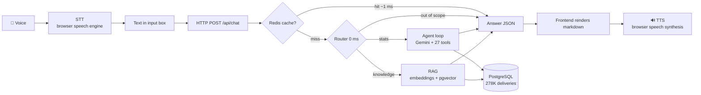

# How It Works — A Voice Query's Complete Journey

Every stage a question travels, from sound waves leaving your mouth to a spoken
answer coming back — with the exact model, storage location, and mechanism at
each hop. Written for the IPL Intelligence Agent (`ipl-intelligence/`).

---

## 0. The whole pipeline at a glance



Twelve stages. Below, each one in depth.

---

## Stage 1 — Voice capture: sound becomes numbers (STT input)

**Model/engine**: the browser's built-in speech recognizer (Web Speech API,
`webkitSpeechRecognition`). In Chrome/Edge this is Google's/Microsoft's speech
service — needs internet, needs **no API key**, costs nothing.

**How sound becomes numbers**: the microphone measures air-pressure changes
thousands of times per second (sampling, typically 16,000 samples/sec). Each
sample is a number (amplitude). This number stream is sliced into ~25 ms
frames; each frame is converted to a frequency fingerprint (which pitches are
present, how strongly — a spectrogram). A neural acoustic model reads these
fingerprint sequences and predicts the most likely words, using a language
model to prefer real phrases ("Virat Kohli" over "wire at coal lee").

**Where stored**: nowhere in our system. Audio goes browser → speech service →
text; we never see or keep audio. The transcript lands in the input box
(`frontend/index.html`, `rec.onresult` sets `q.value`) and the form submits
itself. Privacy note for your users: voice input uses the browser's online
speech service; typed input never leaves your server.

## Stage 2 — The HTTP request

The frontend sends JSON to the backend:

```json
POST http://localhost:8000/api/chat
{"question": "who won IPL 2019", "history": [ ...last 10 turns... ]}
```

FastAPI (`api/main.py`) receives it, validates shape/length with Pydantic
(2–500 chars), stamps a `request_id` (for tracing in logs), and starts the
latency clock.

## Stage 3 — Redis cache check

The question is normalized (lowercase, trimmed) and hashed:
`sha1("who won ipl 2019")` → a fixed key like `ipl:chat:d4e0...`. Redis (an
in-memory key-value store, its own Docker container) is checked:

- **Hit** → stored answer returns in **~1 millisecond**. Sports questions
  repeat constantly; this absorbs most production load.
- **Miss** → continue; the final answer will be stored with a 1-hour TTL.

Only history-free questions are cached (follow-ups depend on conversation).

## Stage 4 — The router (0 ms, no AI)

`route()` in `agent/graph.py` classifies by keywords, deterministically:

| Intent | Trigger examples | What happens |
|---|---|---|
| OUT_OF_SCOPE | "quantum", "football", "stock" | canned polite refusal — **no LLM call at all** |
| CURRENT_DATA | "2026", "live score", "next match" | canned cutoff explanation — no LLM |
| KNOWLEDGE | "why", "rule", "mid-off", "explain", "history" | RAG path (Stage 8) |
| STATS | everything else | agent tool loop (Stages 5-7) |

Why not an LLM router? An LLM classification costs ~1 s and can itself be
wrong. Keywords cost nothing, and anything ambiguous falls to STATS, which
self-corrects (it has the knowledge-search tool too).

## Stage 5 — The LLM (the brain)

**Model**: Gemini `gemini-flash-lite-latest` (free tier), behind an
`LLMProvider` interface (`core/llm.py`) so any OpenAI-compatible model (vLLM,
Ollama, OpenAI) can replace it via env var.

**How an LLM works, briefly**: your text is split into tokens (~word pieces);
each token becomes a vector of numbers (an embedding); dozens of transformer
layers apply *attention* — every token looks at every other token to build
contextual meaning — and the model predicts the next token, repeatedly. It has
absorbed patterns from vast text, which makes it fluent — and also why it
*guesses* facts: it predicts plausible text, not verified truth. That is the
single reason this whole architecture exists.

**What we send**: the system prompt (IPL-only, never state numbers without a
tool, response format), conversation history, the user question, and 27 tool
schemas. `temperature=0.2` keeps output focused (low randomness).

## Stage 6 — Agent + tool calling (the decision loop)

The LLM cannot touch the database. It can only *request* a tool by replying
with structured JSON instead of prose:

```json
{"function_call": {"name": "get_season_stats", "args": {"season": 2019}}}
```

The agent loop (`_stats_agent`) executes: look up the Python function in the
`TOOLS` registry → run it → append the JSON result to the conversation → send
back to the LLM. The model may chain calls (compare = two stats calls) — up to
8 rounds; typical questions need 1–2. When the model finally replies with text
instead of a tool call, that text is the answer. Every call is recorded in a
`trace` with per-tool milliseconds.

How the model knows what tools exist: each tool ships a JSON Schema — name,
description, typed parameters. The descriptions are effectively prompts
("Season overview: final, champion, orange/purple cap") teaching the model
*when* to choose each tool.

## Stage 7 — Tools hit PostgreSQL (the truth)

**Storage**: PostgreSQL container, named Docker volume `postgres_data` (data
survives restarts; never baked into images). Tables: `matches` (1,169),
`deliveries` (278,205 — one row per ball, extras split out), `players` (780),
`officials` (5,817), `match_players` (26,137), plus materialized views
`batting_innings` / `bowling_innings` that pre-aggregate per player per match
with cricket-correct math (wides excluded from balls faced; byes excluded from
bowler runs; run-outs not credited to bowlers).

A tool is a fixed SQL query with parameters — e.g. `get_season_stats(2019)`
finds the last match of season 2019 (the final), the run leader, the wicket
leader. Execution: **under 10 ms**. The LLM never writes SQL; it only picks
which pre-built question to ask. That closes the injection door and the
hallucination door in one move.

## Stage 8 — The RAG path (knowledge questions)

For "explain the Impact Player rule" no SQL table helps — the answer lives in
**16 curated documents** (`rag/knowledge/*.md`: rules, fielding positions,
dismissals, umpire signals, match flow, coach roles, history, rule-changes
timeline).

**Embeddings**: model `BAAI/bge-small-en-v1.5` (runs locally on CPU, cached in
the `hf_cache` Docker volume, ~130 MB). It converts any text into a vector of
**384 numbers** capturing its *meaning* — texts about similar things get
nearby vectors, even with zero shared words ("fielder near the bowler" lands
close to the mid-off document).

**Storage**: the vectors live in the `documents` table (pgvector extension —
vector search inside the same PostgreSQL), column `embedding vector(384)`,
indexed with HNSW (a graph structure for fast nearest-neighbor search).

**Cosine similarity** — how "closeness" is measured: the cosine of the angle
between two vectors, `cos(θ) = (A·B)/(|A||B|)` — dot product divided by
magnitudes. 1.0 = same direction (same meaning), 0 = unrelated. Tiny example
in 2-D: A=[1,0], B=[0.9,0.44] → dot=0.9, magnitudes 1×1.0 → similarity ≈0.9 =
very close. Our vectors do exactly this in 384 dimensions. Real measured
result: query "when did IPL start?" scored **0.849** against the Origins
document — a strong match retrieved in milliseconds.

**Then**: the top-4 documents are pasted into the LLM prompt with the
instruction *"answer ONLY from these documents and cite their titles"* —
retrieval-augmented generation. The model formats; the documents ground.

## Stage 9 — MCP (when other apps ask instead of our frontend)

The MCP server (`mcp_server/server.py`, port 8765) exposes the same 27 tools
over the Model Context Protocol. Any MCP client (Claude Desktop, another
team's agent) does: `list_tools` → receives names + schemas → `call_tool` →
receives results — same contract as Stage 6, but over the network, no access
to our LLM or API required. MCP and RAG are different axes: **RAG = how the
agent finds knowledge; MCP = how outsiders reach the tools.**

## Stage 10 — Answer assembly and response

The system prompt enforces a structure: bold key fact first sentence →
`### Details` bullet list → markdown table for comparisons → `Source:` line.
FastAPI wraps it:

```json
{"answer": "The **Mumbai Indians** won...", "intent": "stats",
 "trace": [{"tool": "get_season_stats", "ms": 8}],
 "latency_ms": 2554, "cached": false, "request_id": "a1b2c3d4"}
```

...stores it in Redis (Stage 3's future hits), appends latency to the rolling
metrics window (`GET /api/metrics` → p50/p95/max, cache hit rate).

## Stage 11 — Frontend renders it

`frontend/index.html` — one file, no frameworks, no build step: semantic HTML,
CSS (navy/gold theme, outfield-stripe background via layered CSS gradients —
drawn, not downloaded, so the app stays offline-capable), and vanilla
JavaScript. A ~40-line markdown renderer converts the answer safely: text is
HTML-escaped first (no injection), then `**bold**`, `### headers`, bullet
lists, `|tables|` and the Source line become styled HTML. A small meta tag
shows seconds taken (+ "cached"). The page is served by FastAPI itself at `/`
— read from disk per request, which is why frontend edits only need a browser
refresh locally (Docker bakes files at build, hence `--build` on laptops).

## Stage 12 — TTS: numbers become voice again

**Engine**: the browser's SpeechSynthesis API — local OS voices, no key, no
network cost. **How text becomes sound**: text → normalization ("113" → "one
hundred and thirteen") → phonemes (sound units) → a synthesizer generates the
waveform — thousands of amplitude numbers per second — sent to the speaker.
Practical engineering in our code: markdown symbols stripped, the Source line
dropped from speech, the answer split into sentences (Chrome silently dies on
one long utterance), a keep-alive pause/resume timer defeats Chrome's ~15 s
mute bug, and an Indian-English voice (`en-IN`) is preferred when installed.
If the user asked by voice, the reply speaks automatically — full
voice-to-voice; the 🔊 toggle forces speech for typed questions too.

---

## Every model/engine in the system

| Stage | Model / engine | Where it runs | Cost |
|---|---|---|---|
| STT (voice→text) | Browser Web Speech API (Google/MS speech service) | browser + its cloud | free, no key |
| Brain / agent LLM | `gemini-flash-lite-latest` (swap: any OpenAI-compatible / vLLM) | Google cloud (free tier) | free tier |
| Embeddings | `BAAI/bge-small-en-v1.5`, 384-dim | local CPU, cached in `hf_cache` volume | free, offline |
| Vector search | pgvector + HNSW index | inside PostgreSQL container | free |
| Cache | Redis 7 | own container | free |
| TTS (text→voice) | Browser SpeechSynthesis (OS voices) | fully local | free |

## Where everything is stored

| Data | Location | Persistence |
|---|---|---|
| Ball-by-ball, matches, players, officials, XIs | PostgreSQL, volume `postgres_data` | survives rebuilds |
| Knowledge docs + 384-dim vectors | `documents` table (pgvector), same Postgres | survives |
| Cached answers | Redis (in-memory) | 1 h TTL, gone on restart — by design |
| Embedding model weights | Docker volume `hf_cache` | survives (no 130 MB re-download) |
| Raw Cricsheet JSON | volume `raw_data` | survives |
| Your voice audio | **nowhere** — transient in the browser | never stored |
| Conversation history | browser memory (last 10 turns), sent per request | gone on refresh — server stays stateless |

## Latency budget (measured)

| Stage | Time |
|---|---|
| STT transcription | ~0.5–1 s (browser side) |
| Cache hit | **~1 ms** total |
| Router | 0 ms |
| LLM round | ~0.7–1.5 s each (1–2 rounds typical) |
| SQL tool | <10 ms |
| RAG retrieve | ~50–200 ms (embed query + HNSW) |
| Markdown render | ~1 ms |
| TTS start | ~0.2 s |
| **Typical stats answer** | **~2–3 s** · knowledge ~8–9 s · refusal 0 ms |

## One complete worked example

You tap 🎤 and say **"who won IPL 2019"**:

1. Mic samples your voice 16,000×/sec → browser speech service → text
   `"who won IPL 2019"` appears in the box, form auto-submits.
2. `POST /api/chat` → request `f3a9c1d2` → Redis miss.
3. Router: no out-of-scope/knowledge markers → **STATS**.
4. Gemini receives prompt + 27 schemas → replies
   `get_season_stats(season=2019)`.
5. Tool runs SQL: final = last match of 2019 → MI beat CSK by 1 run,
   Rajiv Gandhi Intl. Stadium, POM Jasprit Bumrah; leaders computed. 8 ms.
6. Result JSON returns to Gemini → it writes: "The **Mumbai Indians** won the
   IPL 2019 final, defeating Chennai Super Kings by 1 run..." + Details
   bullets + Source line.
7. FastAPI caches it, returns with `latency_ms: 2554`.
8. Frontend renders bold/bullets; because you asked by voice, TTS speaks it.
9. Anyone asking the same question within an hour: **1 ms**.

Every number in that spoken sentence came from a database row that can be
traced to a specific ball bowled on 12 May 2019. That's the whole point.
