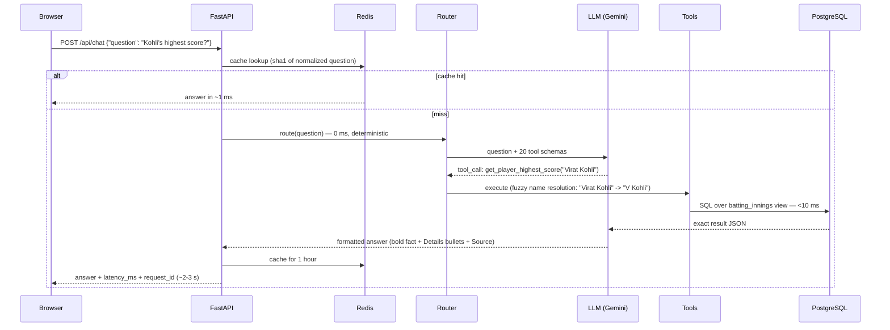
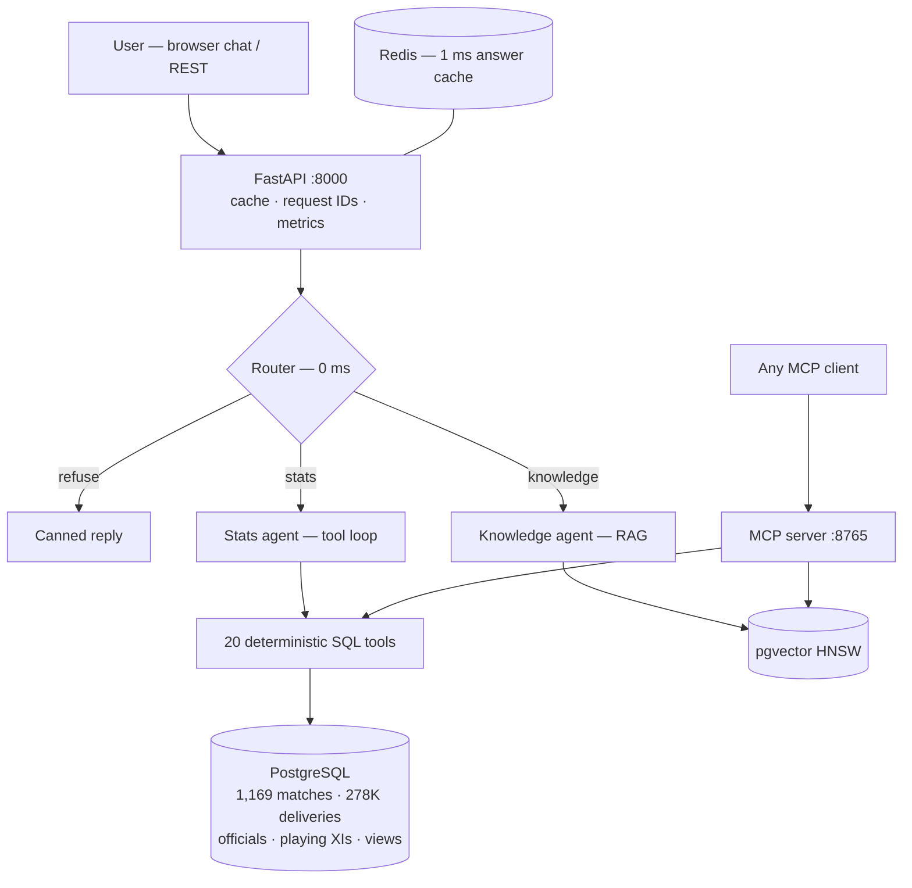

# IPL Intelligence Agent — Complete Interview Guide

How this project works end-to-end, and how to explain every concept — LLM,
Agent, Tools, Tool Calling, MCP, RAG, Router, Workflow — with the **when, why,
and how** an interviewer probes for. Every number in this document was measured
on the running system, not estimated.

---

## 1. The 30-second pitch (memorize)

> "I built a production-style IPL cricket assistant where the LLM never invents
> statistics. A deterministic router classifies each question; exact stats come
> from PostgreSQL computed over 278,000 ball-by-ball deliveries; meaning-based
> questions go through RAG on pgvector; and all tools are exposed both
> in-process and over MCP so any AI client can use them. It runs as five Docker
> services, answers in about 2–3 seconds cold and 1 millisecond cached, refuses
> out-of-scope questions in 0 milliseconds without an LLM call, and ships with
> a two-layer test suite — 13 database ground-truth checks and a 7-question
> agent eval — all passing."

---

## 2. The concepts — when, why, how (each in this project)

### LLM (Large Language Model)
- **What**: the model that reads text and writes text. Here: Gemini
  (`gemini-flash-lite-latest`), swappable to any OpenAI-compatible endpoint
  (OpenAI, vLLM, Ollama) via one env var.
- **When it's used**: only twice per question — deciding which tools to call,
  and writing the final sentence around tool results.
- **Why not let it answer directly**: LLMs are trained predictors, not
  databases. Asked "Kohli's runs?", a bare LLM produces a *plausible* number,
  not the *true* number. I proved this during development: when a bug silently
  broke my tools, the model confidently answered with wrong stats from memory.
- **How it's abstracted** (`core/llm.py`): an `LLMProvider` interface with
  `GeminiProvider` and `OpenAICompatProvider`. The agent code never imports a
  vendor SDK — swapping providers is config, not a rewrite.

### Tools
- **What**: plain Python functions the LLM is allowed to invoke. 20 of them in
  `stats/engine.py` — batting/bowling/fielding stats, phase splits, records,
  head-to-head, batter-vs-bowler duels, squads, playing XIs, umpire records,
  season summaries, venue stats, knowledge search.
- **Why deterministic SQL tools**: SQL over validated data is exact, testable,
  and fast (<10 ms). The rule of the whole system: **LLM decides, tools know,
  database never lies.**
- **How they stay safe**: no arbitrary-SQL tool exists. Every tool is a typed
  function with a fixed query shape — the LLM chooses *which* question to ask
  the database, never *how*.

### Tool Calling (function calling)
- **What**: instead of replying with text, the LLM replies with structured
  JSON: `{"name": "get_player_batting_stats", "args": {"player": "Virat Kohli"}}`.
  My code executes the function and sends the result back; the model then
  either calls another tool or writes the final answer.
- **The loop** (`agent/graph.py::_stats_agent`): up to 8 rounds of
  model → tool call → execute → feed result back → model. Most questions
  finish in 1–2 rounds.
- **How the model knows the tools**: each tool ships a JSON Schema (name,
  description, typed parameters). Descriptions are prompt engineering — "IPL
  batting stats for a player; season optional" tells the model when to pick it.
- **A real trace** (from the running system):
  ```
  User: "What is Virat Kohli's highest IPL score?"
  LLM  -> tool_call: get_player_highest_score(player="Virat Kohli")
  DB   -> {"runs":113,"balls":50,"opponent":"Kings XI Punjab",
           "venue":"M Chinnaswamy Stadium","season":2016,"strike_rate":226.0}
  LLM  -> "Kohli's highest IPL score is **113 off 50 balls** vs Kings XI
           Punjab at the Chinnaswamy in 2016..."
  ```

### Agent
- **What**: an LLM in a loop with tools and a goal — it *decides actions*
  instead of just generating text. The `answer()` function in `agent/graph.py`
  IS the agent: route → pick tools → execute → synthesize.
- **Why an agent, not one hardcoded query per question type**: users phrase
  questions infinitely many ways and chain follow-ups ("what about his
  bowling?"). The agent generalizes; hardcoded intents don't.
- **Supervisor pattern**: one router delegates to two specialist paths —
  Statistics agent (tool loop) and Knowledge agent (RAG). Out-of-scope and
  post-cutoff questions never reach any LLM at all.
- **Why NOT a framework (LangGraph/CrewAI)**: one agent, 20 tools. The loop is
  ~40 lines. A framework earns its complexity at multi-agent graphs with
  checkpointing; below that it's dependency weight and debugging distance.
  (Deliberate, documented deviation — great interview talking point.)

### Router (intent classification)
- **What** (`route()` in `agent/graph.py`): deterministic keyword classifier
  producing STATS / KNOWLEDGE / CURRENT_DATA / OUT_OF_SCOPE.
- **Why deterministic, not an LLM classifier**: an LLM router adds a full
  model round-trip (~1 s) to EVERY question and can itself hallucinate.
  Keywords are 0 ms, testable, and anything ambiguous safely falls through to
  the stats agent, which self-corrects via tools.
- **Measured payoff**: "What is quantum computing?" → polite refusal in
  **0 ms, zero LLM cost**. That's also the cheapest possible guardrail.

### MCP (Model Context Protocol)
- **What**: an open standard that lets any AI application discover and call
  your tools over a wire protocol — like USB for AI tools.
- **What I built** (`mcp_server/server.py`): a FastMCP server exposing the
  same 20 tools on port 8765 (streamable-http). Claude Desktop, Cursor, or
  another team's agent can query my cricket database without touching my API
  or paying for my LLM.
- **Why it matters architecturally**: it decouples *tools* from *brain*. The
  toolset becomes an independent product with a standard interface.
- **How discovery works**: client calls `list_tools` → gets names,
  descriptions, JSON Schemas → calls `call_tool(name, args)` → gets results.
  Same contract as in-process tool calling, but over the network.

### RAG (Retrieval-Augmented Generation)
- **What**: embed documents as vectors; at question time, embed the question,
  fetch nearest documents, let the LLM answer *from them* with citations.
- **Where used**: ONLY for unstructured knowledge — IPL origins, rules,
  franchise history, cultural impact. Stack: `BAAI/bge-small-en-v1.5`
  embeddings (384-dim) + pgvector HNSW index, same PostgreSQL instance.
- **Where deliberately NOT used — the key interview answer**: statistics.
  Embeddings are lossy similarity, they cannot count or aggregate. Asking a
  vector index "how many runs" is using a similarity engine for arithmetic.
  SQL answers it exactly. **RAG for meaning, SQL for math.**
- **When you'd expand it**: ingesting match reports/commentary for questions
  like "why did RCB collapse in that final?" — narrative, not numeric.

### Workflow — one request end-to-end


---

## 3. Architecture — five services



| Service | Role | Why separate |
|---|---|---|
| postgres (pgvector image) | truth store: relational + vectors in one engine | persistent volume; one backup story |
| redis | exact-match answer cache | repeat sports questions are extremely common |
| ingest (one-shot) | download → validate → normalize → insert → verify | pipeline is a *job*, not a server; compose gates on its success |
| api | gateway + agent + frontend | stateless → horizontally scalable |
| mcp | tools over the protocol | independent consumers, independent scaling |

## 4. Data pipeline (the data-engineering story)

1. **Source**: Cricsheet ball-by-ball JSON (CC BY 4.0), one file per match.
2. **Validation in**: date parseable, exactly 2 teams, **cutoff 2025-12-31
   enforced here** — 74 post-cutoff files rejected at the door, so the model
   can't leak 2026 data even by accident.
3. **Normalization + identity resolution**: names → surrogate keys (`teams`,
   `players`, `venues`); alias table for player identity across seasons.
4. **Load**: matches, 278,205 deliveries (extras split into wides/noballs/
   byes/legbyes — needed for correct SR/economy), officials (5,817 rows),
   playing XIs (26,137 rows).
5. **Derived stats**: materialized views `batting_innings` / `bowling_innings`
   with cricket-correct math: balls faced exclude wides; bowler runs exclude
   byes/legbyes; run-outs never credit the bowler.
6. **Validation out**: report counts duplicates, orphans, negative runs,
   invalid overs — any non-zero **fails the pipeline** (exit 1). Idempotent:
   re-runs skip loaded matches, backfill new tables.

## 5. Correctness — how I *know* answers are right

| Layer | Mechanism | Result |
|---|---|---|
| Construction | numbers only from tools; prompt forbids memory stats | by design |
| Pipeline | validation report gates ingestion | all checks 0 |
| DB truth | `tests/test_engine.py` — 13 assertions, no LLM | 13/13 |
| End-to-end | `tests/eval_agent.py` — golden QA + intent + refusals | 7/7 |
| Spot audit | vs public records: RCB 2025 title, Prasidh 25 wkts, Gayle 175, Jaiswal 13-ball fifty | all match |

Honest caveat to volunteer: string-matching eval catches wrong facts, not
misleading phrasing. Next layer would be a validator that extracts every number
from the answer and asserts it appeared in that turn's tool outputs.

## 6. Latency — measured, explained, engineered

| Path | Measured | Mechanism |
|---|---|---|
| Out-of-scope / post-2025 | **0 ms** | router, no LLM |
| Repeat question | **~1 ms** | Redis exact-match, TTL 1 h |
| Stats (cold) | ~2–3 s | 1–2 LLM rounds + <10 ms SQL |
| Knowledge (cold) | ~8–9 s | RAG + grounded generation |

Optimizations already shipped: deterministic router (skips LLM entirely),
Redis cache, **fuzzy name resolution in tools** — "Virat Kohli" resolves
in-tool (exact → alias → initial+surname → most-capped candidate), which
removed the search_player round-trip and cut measured latency **4.4 s → 2.7 s**.
Remaining ceiling is the free LLM tier itself; a paid tier removes retry waits.
Next steps: semantic cache (embed questions, serve near-duplicates), answer
streaming for perceived latency.

## 7. Security

- No arbitrary SQL exposed to the LLM — typed tools only (v2 hardening over v1).
- Containers run non-root; volume mount points chown'd at build.
- Secrets via `.env`/environment only — never in images or git (public repo
  was secret-scanned before flipping visibility).
- Pydantic caps input length; production adds HTTPS + auth at a reverse proxy.

## 8. Honest limitations (rehearse this — it lands well)

Coaches, physios, support staff, auction prices: **no free licensed source
exists** — that's BCCI/commercial data. The schema and ingestion interfaces
exist; the tools answer "data not available" honestly. I refused to fabricate
data my pipeline couldn't verify — in a system whose whole thesis is
zero-hallucination, fake seed data would poison the one guarantee that matters.

## 9. War stories (pick one for "hardest bug?")

1. **The silent hallucination.** `from __future__ import annotations` turned
   type hints into strings; the Gemini SDK crashed on every tool call — and the
   model, finding all tools "broken", answered from memory with confident wrong
   stats. Lesson: integration failures masquerade as model failures; trace the
   actual tool calls, then add regression evals so silence can't hide.
2. **Gemini 3 thought signatures.** Replaying function-call turns rebuilt by
   hand triggered `missing thought_signature` API errors. Fix: store and replay
   the model's original content verbatim. Lesson: treat provider payloads as
   opaque; don't reconstruct what you can replay.
3. **Docker volume permissions.** Non-root container + fresh named volume =
   root-owned mount → `PermissionError` on the user's laptop but not my dev
   box (volume pre-existed). Fix: create and chown mount points in the image
   before `USER`. Lesson: first-run experience needs a clean-machine test.
4. **SDK major-version break.** mcp 2.0 renamed the server class and changed
   client returns; google-genai couldn't ingest 2.0 sessions (deepcopy crash).
   Fix: pin `mcp<2`, version-tolerant imports, manual list_tools/call_tool
   bridge. Lesson: pin dependencies; own your protocol layer when SDKs wobble.
5. **Two Kohlis.** Fuzzy matching "Kohli" hit V Kohli *and* T Kohli. Fix:
   initial+surname pattern, then most-capped-candidate tiebreak. Lesson:
   identity resolution is a real data problem even at 780 names.

## 10. Prepared Q&A

**Why not fine-tune a model on IPL data?** Fine-tuning teaches style, not
reliable facts — it still hallucinates numbers, costs GPU money per update, and
goes stale. Tool grounding is exact and updating data is re-running ETL.

**Why PostgreSQL over SQLite here?** v1 used SQLite deliberately. v2 needed
pgvector co-located with relational data, concurrent multi-service access
(api + mcp + ingest), and a managed-DB path for multi-server deployment.

**Why one vector DB inside Postgres instead of a dedicated one?** At 4–1,000
documents, pgvector's HNSW is more than enough and removes an entire service.
Dedicated engines (Qdrant/Milvus) earn their ops cost at millions of vectors.

**What if Gemini goes down?** Provider abstraction: flip `LLM_PROVIDER=openai`
with any OpenAI-compatible base URL (vLLM self-hosted included). Transient
429/503/network errors already retry with backoff.

**How does it scale to 10,000 users?** API is stateless → N replicas behind a
load balancer; shared Postgres + Redis; cache absorbs repeat traffic; per-user
rate budgeting on the LLM. Same image on every server — registry workflow
documented in the README.

**How do you add IPL 2026 later?** Bump `DATA_CUTOFF`, re-run ingest
(idempotent), views refresh, flush Redis. One config value controls the
guardrail at ingestion, prompt, and router simultaneously.

**What would you build next?** Number-validator on answers, semantic cache,
streaming responses, commentary RAG corpus, OpenTelemetry traces, the 300-question
eval set, licensed staff/auction data behind the existing interfaces.

## 11. Numbers to say from memory

| Number | What |
|---|---|
| 1,169 / 278,205 | matches / deliveries (2008 → Dec 2025) |
| 780 · 5,817 · 26,137 | players · official rows · playing-XI rows |
| 20 | tools (agent + MCP, one registry) |
| 13/13 · 7/7 | DB tests · agent eval |
| 0 ms · 1 ms · ~2.7 s | refusal · cached · cold stats answer |
| 4.4 → 2.7 s | latency cut from in-tool fuzzy name resolution |
| 5 | Docker services |
| 113 (50) · 175 · 13 | Kohli's highest · Gayle record · Jaiswal fastest fifty balls |
