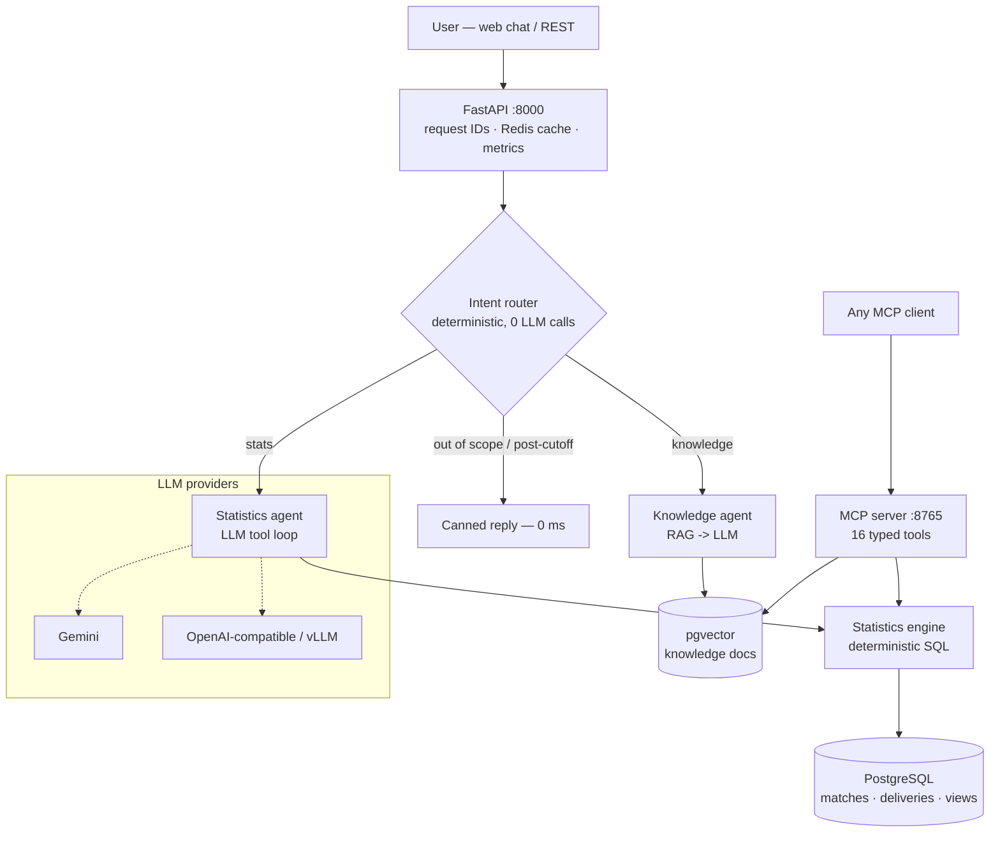

# IPL Intelligence Agent

Production-grade, IPL-only AI assistant. Data: 2008 → **31 Dec 2025** (hard
cutoff, enforced at ingestion). LLM never invents numbers — every statistic
comes from PostgreSQL, computed from ball-by-ball data.

**Verified state (all run live, not aspirational):** 1,169 matches / 278K
deliveries ingested, validation report clean; engine tests **13/13 PASS**
(Kohli 8,671 runs; highest 113(50) vs KXIP @ Chinnaswamy 2016; Gayle 175
record); agent eval **7/7 PASS** (p50 2.3 s; out-of-scope answered in 0 ms);
Redis cache hit serves in **1 ms** vs ~2.5 s miss.

## 1. Architecture



## 2. Directory tree

```
ipl-intelligence/
├── api/main.py          FastAPI gateway: /api/chat, REST, /api/metrics, frontend
├── agent/graph.py       intent router + stats/knowledge agents (supervisor graph)
├── core/config.py       env-driven configuration (+.env loader)
├── core/db.py           psycopg connection pool + JSON-safe query helpers
├── core/llm.py          LLMProvider abstraction: GeminiProvider, OpenAICompatProvider
├── db/schema.sql        normalized schema + materialized views + pgvector + provenance
├── ingest/ingest.py     download -> validate -> normalize -> resolve ids -> insert -> report
├── stats/engine.py      deterministic SQL analytics (career/season/phase/records/duels)
├── rag/store.py         pgvector embed + HNSW search
├── rag/knowledge/*.md   curated history/rules/context documents
├── mcp_server/server.py FastMCP server — 16 typed tools, no raw SQL exposed
├── frontend/index.html  chat UI (latency + intent + tool trace shown per answer)
├── tests/test_engine.py deterministic DB ground-truth suite (no LLM, CI-able)
├── tests/eval_agent.py  end-to-end golden-QA eval incl. out-of-scope behavior
├── Dockerfile           multi-stage, non-root user, healthcheck
├── docker-compose.yml   postgres+pgvector · redis · ingest(one-shot) · api · mcp
└── .env.example
```

## 3. Run it

**Local dev** (Postgres/Redis in Docker, app on host):

```bash
docker run -d --name iplpg -e POSTGRES_USER=ipl -e POSTGRES_PASSWORD=ipl \
  -e POSTGRES_DB=ipl -p 5433:5432 pgvector/pgvector:pg16
docker run -d --name iplredis -p 6380:6379 redis:7-alpine

python -m venv venv && source venv/bin/activate
pip install torch --index-url https://download.pytorch.org/whl/cpu
pip install -r requirements.txt
cp .env.example .env                # put your GEMINI_API_KEY in it

python -m ingest.ingest             # schema + data + validation report
python -m rag.store                 # embed knowledge docs
python -m tests.test_engine         # 13 DB ground-truth checks
uvicorn api.main:app --port 8000    # open http://localhost:8000
```

**Full Docker deployment:**

```bash
cp .env.example .env    # add GEMINI_API_KEY
docker compose up --build
# order: postgres(healthy) -> ingest(one-shot, exits 0) -> api :8000 + mcp :8765
```

**MCP standalone test:** `npx @modelcontextprotocol/inspector python -m mcp_server.server`

## 4. API

| Endpoint | Purpose |
|---|---|
| `POST /api/chat` | agent answer + intent + tool trace + latency_ms + request_id |
| `GET /api/players/{name}/stats` | batting+bowling+fielding (404 if unknown) |
| `GET /api/seasons/{year}` | final, champion, orange/purple cap |
| `GET /api/records` | all-time records, computed live |
| `GET /api/health` | postgres + redis status |
| `GET /api/metrics` | p50/p95/max latency, cache hit rate |
| `GET /` | chat frontend |

## 5. Latency strategy (measured)

| Path | Latency | Why |
|---|---|---|
| Out-of-scope / post-cutoff | **0 ms** | deterministic router, no LLM call |
| Repeat question | **~1 ms** | Redis exact-match cache (TTL 1 h) |
| Stats question (cold) | ~2–4 s | 2-3 LLM rounds + SQL (SQL itself <10 ms) |
| Knowledge question | ~8–9 s | RAG retrieve + grounded generation |

Levers, in impact order: paid LLM tier (removes free-tier retry waits) →
cache TTL/warming → fewer tool rounds (name-resolution caching) → semantic
cache (embed the question, serve near-duplicates).

## 6. Correctness strategy

1. **Grounding by construction** — numbers only from tools; prompt forbids memory stats.
2. **Deterministic tests** (`tests/test_engine.py`) — 13 DB ground-truth checks, no LLM.
3. **Agent eval** (`tests/eval_agent.py`) — golden QA incl. intent + out-of-scope: 7/7.
4. **Ingestion validation report** — duplicates/orphans/negative-runs checked on every load; non-zero fails the pipeline.
5. **Provenance** — `data_sources` table + `source` field in stat responses.

## 7. Multi-server / production deployment

```
            Load balancer (nginx / cloud LB, HTTPS)
                 │                    │
        Server 1: api replica   Server 2: api replica     (stateless — scale N)
                 └──────────┬─────────┘
              shared PostgreSQL (managed / Server 3)
              shared Redis      (managed / Server 3)
```

API containers are stateless (all state in Postgres/Redis) — same image runs
on every server: `docker compose up api` with `DATABASE_URL`/`REDIS_URL`
pointing at the shared instances. Registry workflow:

```
git push -> CI (GitHub Actions) -> docker build -> docker tag ghcr.io/you/ipl-intelligence:sha
        -> docker push -> each server: docker pull + docker compose up -d
```

Secrets: `.env` locally (gitignored); in production use the platform secret
store (GitHub Actions secrets, AWS SSM, etc.). Never bake keys into images —
this compose passes them via environment only.

## 8. Data update strategy

Cutoff is config (`DATA_CUTOFF`). To add a season later: bump cutoff, rerun
`ingest` (idempotent — already-loaded matches skipped), `REFRESH MATERIALIZED
VIEW`s run automatically, flush Redis. Provenance rows record each load.

## 9. Honest limitations (spec rule 29 — no fabricated data)

- **Coaches / support staff / auctions / physios**: no free licensed source.
  Tables + ingestion interfaces exist; tools answer "data not available" honestly.
- **Player bios**: nationality/DOB not in Cricsheet; `players` bio columns
  ready for a licensed source.
- Orange/Purple Cap computed from ball-by-ball (matches official results).
- Eval set is a starter (deterministic 13 + golden 7). The spec's 300-question
  set is a data-authoring task — extend `tests/` incrementally.

## 10. Documented deviations from the spec (deliberate)

| Spec asked | Built | Why |
|---|---|---|
| LangGraph | Hand-rolled supervisor graph (`agent/graph.py`) | Same pattern, zero extra deps, lower latency; router is deterministic (spec §14 priority) |
| SQLAlchemy + Alembic | Raw SQL schema + psycopg pool | One fewer abstraction for a read-only analytical schema; migration = versioned schema.sql |
| Next.js frontend | Single-file responsive chat UI served by FastAPI | Ships working chat (latency/intent/trace visible) without a Node toolchain; Next.js is a clean future swap |
| 4th "Current Data" agent | Deterministic canned path | Post-cutoff questions need refusal, not an agent — 0 ms and can't hallucinate |

## 11. Security

Read-only DB role recommended for api/mcp containers; no raw SQL tool exposed
over MCP (typed tools only); non-root containers; input length caps via
Pydantic; secrets via env; put the API behind HTTPS + auth at the LB for
public deployment.

## 12. Troubleshooting

| Symptom | Fix |
|---|---|
| `no configuration file provided` | run compose inside `ipl-intelligence/` |
| api unhealthy, postgres fine | check `GEMINI_API_KEY` in `.env`; `docker compose logs api` |
| 429/503 in answers | free-tier limits — retries automatic; paid tier removes |
| ingest exits non-zero | validation failed — read its log, it names the check |
| stale answers after data update | flush Redis: `docker compose exec redis redis-cli FLUSHALL` |

Data: [Cricsheet](https://cricsheet.org) (CC BY 4.0). Commercial use of IPL
data requires a license from BCCI/official partners.
